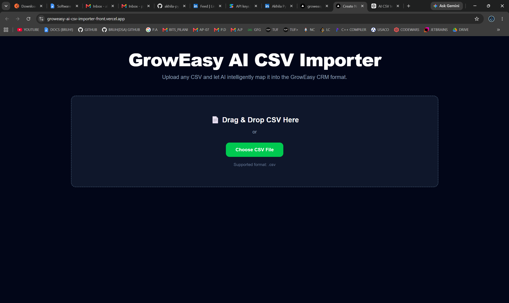
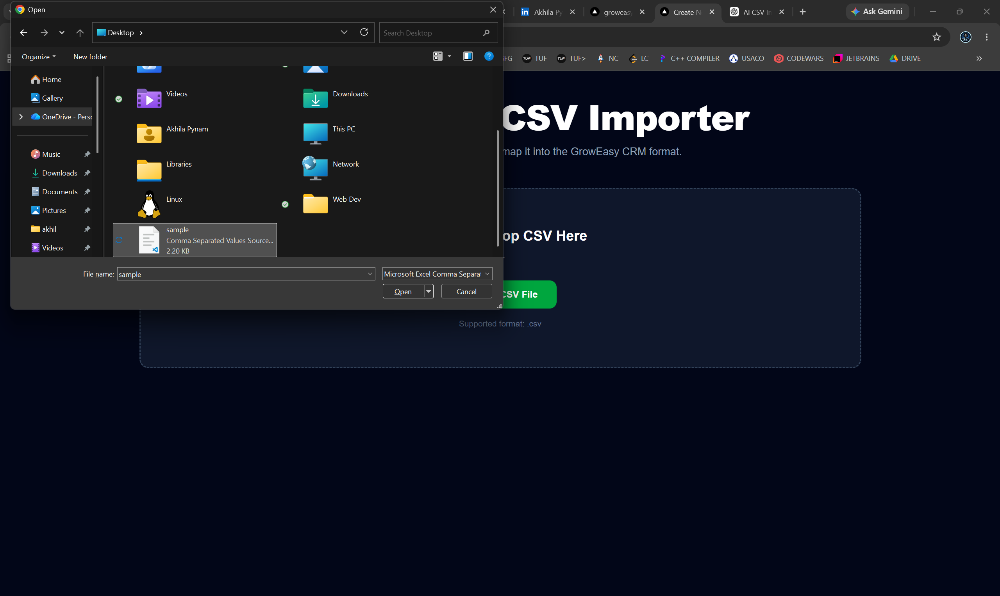
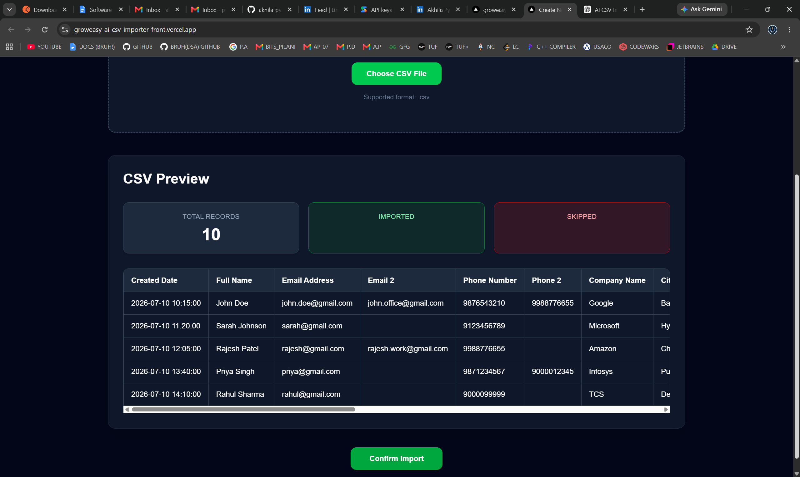
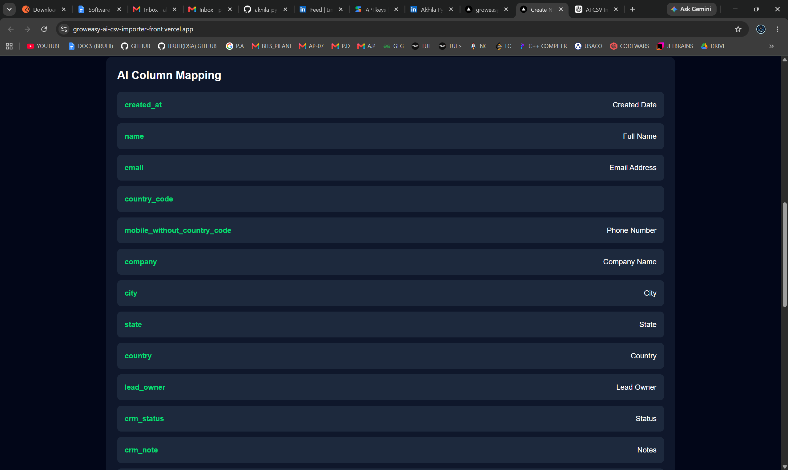
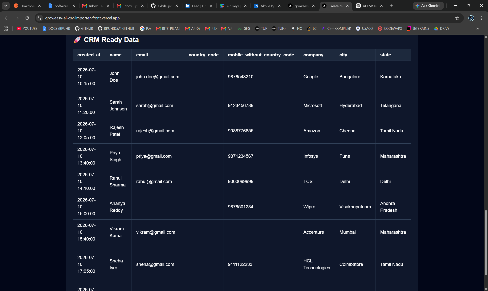

# 🚀 GrowEasy AI CSV Importer

> AI-powered CSV Importer that intelligently maps any CSV file into the GrowEasy CRM format using Google Gemini AI.

---

## 🌐 Live Demo

**Hosted Application**

🔗 https://groweasy-ai-csv-importer-front.vercel.app/

---

## 💻 GitHub Repository

🔗 https://github.com/akhila-pynam/groweasy-ai-csv-importer

---

# 📖 Overview

GrowEasy AI CSV Importer is a full-stack web application developed for the **GrowEasy Software Developer Internship Assignment**.

Traditional CSV importers require users to upload files with predefined column names. This application removes that limitation by using **Google Gemini AI** to intelligently understand different CSV structures and automatically map them to the required GrowEasy CRM schema.

Users can upload CSV files from different sources such as Facebook Ads, Google Ads, Excel Sheets, CRM exports, or custom CSV files without manually mapping each column.

---

# ✨ Features

## Frontend

- Responsive UI
- Drag & Drop CSV Upload
- CSV File Picker
- CSV Preview
- Import Statistics
- AI Mapping Preview
- CRM Ready Data Preview
- Responsive Tables
- Loading Indicators
- Error Handling
- Light & Dark Theme

---

## Backend

- REST API using Express
- CSV Upload API
- CSV Parsing
- Google Gemini AI Integration
- Intelligent Column Mapping
- CRM Data Transformation
- Record Validation
- Invalid Record Skipping
- Structured JSON Response
- TypeScript

---

# 🤖 AI Mapping

Google Gemini AI automatically understands different column names.

Example

| CSV Column | CRM Field |
|------------|-----------|
| Customer Name | name |
| Full Name | name |
| Mail | email |
| Email Address | email |
| Phone | mobile_without_country_code |
| Contact Number | mobile_without_country_code |
| Organization | company |
| Company | company |
| City | city |

No hardcoded mappings are used.

---

# 📊 CRM Fields

The application extracts the following CRM fields.

- created_at
- name
- email
- country_code
- mobile_without_country_code
- company
- city
- state
- country
- lead_owner
- crm_status
- crm_note
- data_source
- possession_time
- description

---

# 🛠 Tech Stack

### Frontend

- Next.js
- React
- TypeScript
- Tailwind CSS

### Backend

- Node.js
- Express.js
- TypeScript

### AI

- Google Gemini AI

### CSV Parsing

- PapaParse

---

# 📂 Project Structure

```text
groweasy-ai-csv-importer
│
├── backend
│   ├── src
│   │   ├── controllers
│   │   ├── middleware
│   │   ├── prompts
│   │   ├── routes
│   │   ├── services
│   │   ├── utils
│   │   ├── app.ts
│   │   └── server.ts
│   │
│   ├── uploads
│   ├── package.json
│   └── tsconfig.json
│
└── frontend
    ├── app
    ├── components
    ├── services
    ├── public
    ├── package.json
    └── next.config.ts
```

---

# ⚙️ Installation

## Clone Repository

```bash
git clone https://github.com/akhila-pynam/groweasy-ai-csv-importer.git
cd groweasy-ai-csv-importer
```

---

## Backend Setup

```bash
cd backend
npm install
```

Create a `.env` file.

```env
PORT=5000
GEMINI_API_KEY=YOUR_GEMINI_API_KEY
```

Start the backend.

```bash
npm run dev
```

Backend runs at

```
http://localhost:5000
```

---

## Frontend Setup

```bash
cd frontend
npm install
npm run dev
```

Frontend runs at

```
http://localhost:3000
```

---

# 🔌 API Endpoints

## Health Check

```http
GET /api/health
```

---

## Preview CSV

```http
POST /api/preview
```

Returns

- CSV Preview
- Column Names
- Total Rows

---

## Upload CSV

```http
POST /api/upload
```

Returns

- AI Column Mapping
- CRM Ready Data
- Imported Count
- Skipped Count

---

# 🔄 Workflow

```text
Upload CSV
      │
      ▼
Preview CSV
      │
      ▼
Confirm Import
      │
      ▼
Parse CSV
      │
      ▼
Google Gemini AI
      │
      ▼
Generate CRM Mapping
      │
      ▼
Validate Records
      │
      ▼
Transform Into CRM Format
      │
      ▼
Return Structured JSON
      │
      ▼
Display CRM Ready Data
```

---

# ✅ Validation Rules

The importer follows the assignment requirements.

- Skip invalid records
- Preserve CSV integrity
- Validate required CRM fields
- Return structured JSON
- Handle different CSV formats
- AI-based column mapping

---

# 📄 Supported CSV Files

The application supports CSV exports from

- Facebook Lead Export
- Google Ads Export
- Excel Sheets
- Sales Reports
- Marketing Agencies
- Real Estate CRM
- Custom CSV Files

---

# 📸 Screenshots

Add screenshots of the following pages.

- Home Page 

- CSV Upload 

- CSV Preview 
  
- AI Mapping 

- CRM Ready Data 


---

# 📈 Future Improvements

- Database Integration
- Authentication
- Export CRM CSV
- Docker Support
- Batch Processing
- Streaming CSV Parsing
- Unit Testing
- Retry Failed AI Requests
- Cloud Backend Deployment

---

# ✔ Assignment Checklist

| Requirement | Status |
|-------------|--------|
| Upload CSV | ✅ |
| CSV Preview | ✅ |
| AI Column Mapping | ✅ |
| CRM Data Transformation | ✅ |
| Record Validation | ✅ |
| JSON Response | ✅ |
| Responsive UI | ✅ |
| Loading Indicators | ✅ |
| Error Handling | ✅ |
| GitHub Repository | ✅ |
| Hosted Frontend | ✅ |
| README Documentation | ✅ |

---

# 👨‍💻 Author

## Akhila Pynam

**B.Tech Computer Science & Engineering**

### GitHub

https://github.com/akhila-pynam

### LinkedIn

https://www.linkedin.com/in/akhila-pynam-ba0369338/

---

# 📜 License

This project was developed for the **GrowEasy Software Developer Internship Assignment**.

© 2026 Akhila Pynam
